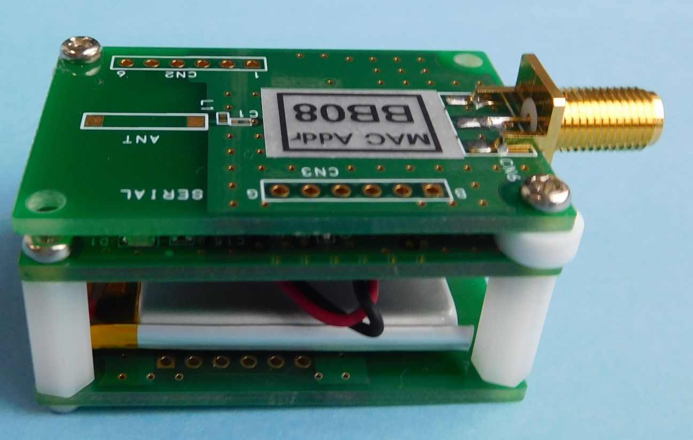
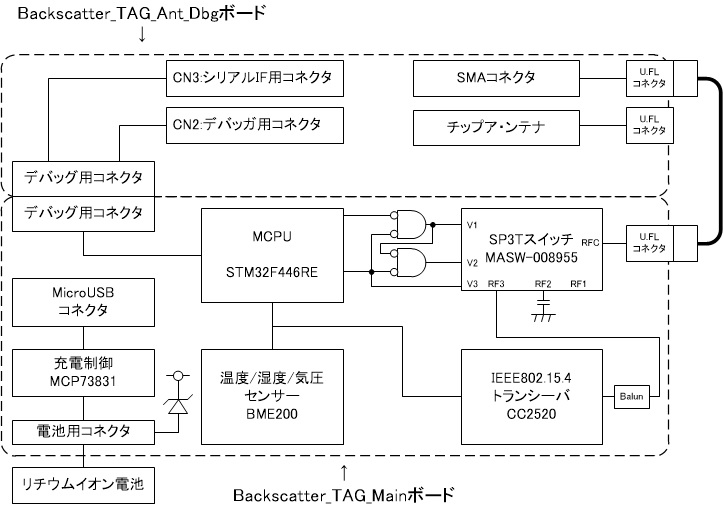
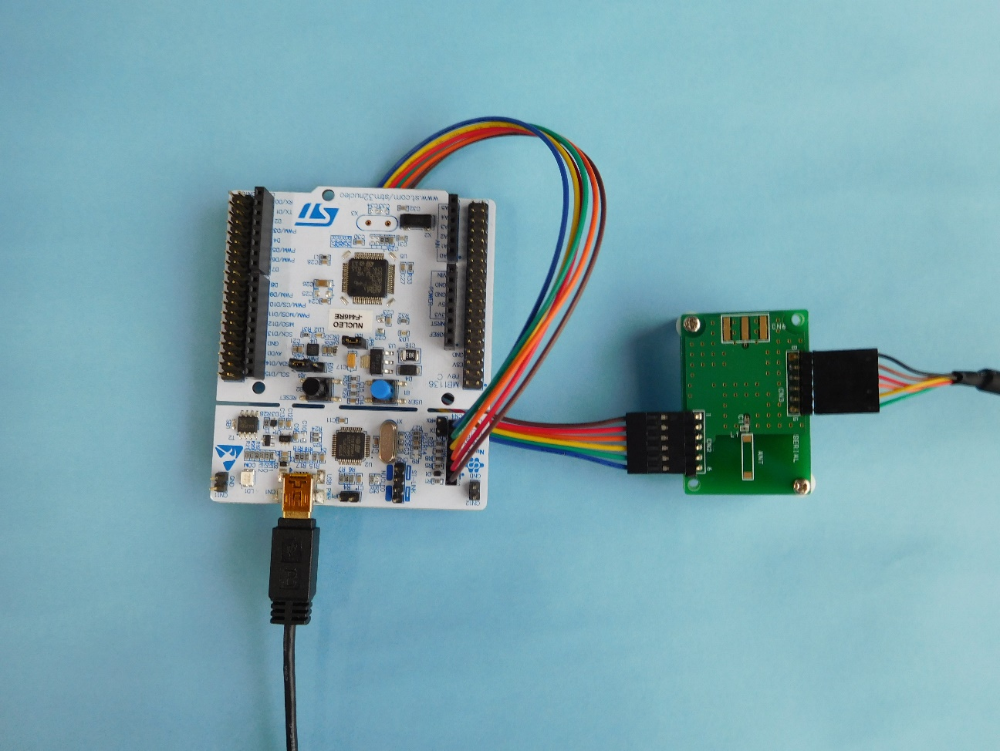
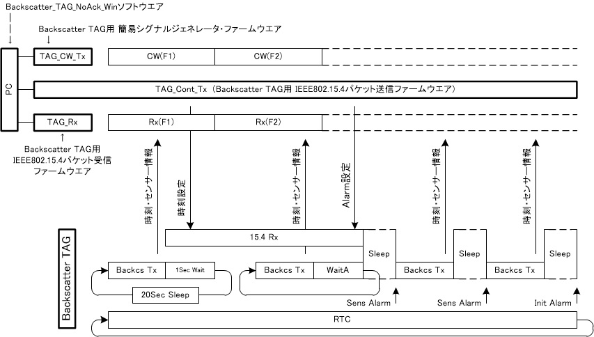
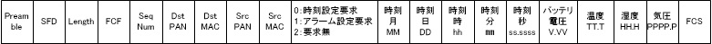
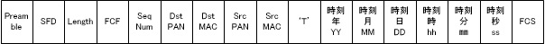
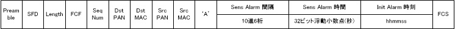
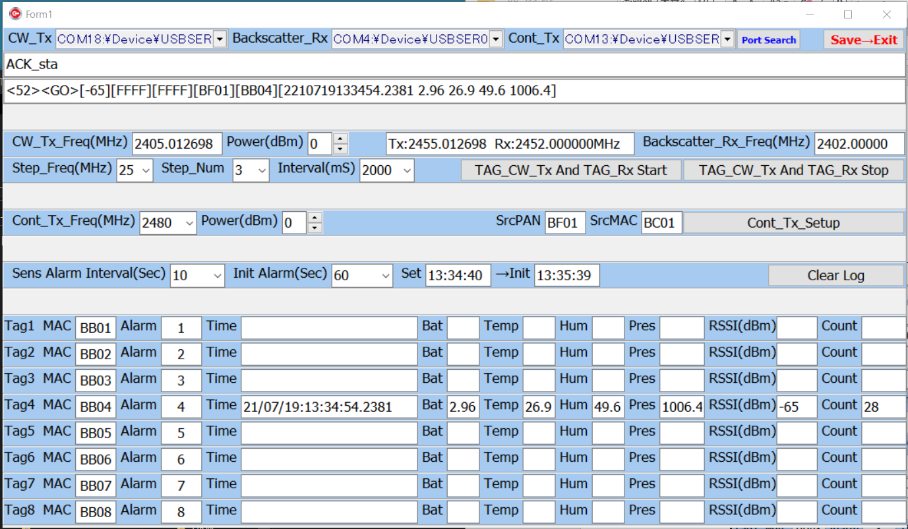

# IEEE802.15.4\_Backscatter\_TAG\_2.0ハードウエア

無償の回路図設計CAD であるCADLUS
Circuit及び無償のプリント基板設計CADであるCADLUS Xを用いて設計しています。
CADLUS XのCOMPファイル、部品表、部品配置図を準備してP版.comに依頼すれば基板製造、部品調達、部品実装を行い完成したプリント基板を入手できます。
回路の変更、追加や他の設計の参考になるように全てのデータを公開します

以下の様に3枚のボードで構成しています。

、②Backscatter\_Mainボード、③Backscatter\_TAG\_Ant\_Dbgボード(部品無し)")
左から①Backscatter\_TAG\_Ant\_Dbgボード(SMAコネクタ実装)、②Backscatter\_Mainボード、③Backscatter\_TAG\_Ant\_Dbgボード(部品無し)

①はSMAコネクタ実装したボード、②チップアンテナを実装したボード、②Mainボードに実装したマイコンへのプログラム書き込みとデバッグ用コネクタを実装したボードの3種類を製作しています。(写真はSMAコネクタを実装したボードです)

Backscatter\_TAG\_Ant\_Dbgボード(SMAコネクタ実装)、Backscatter\_Mainボードを接続している白いケーブルは、U.FLケーブルアセンブリ：U.FL-2LP(V)-04N1-A-(35)
です。

リチウムイオンポリマー電池は400ｍAH、保護回路付き、35㎜×25㎜×5㎜、型名：DTP502535(PHR)です。

長さ15㎜M2.6両メネジスペーサ、長さ3㎜M2.6中空スペーサ、長さ8㎜M2.6黄銅鍋ネジ、長さ6㎜M2.6黄銅鍋ネジを用いて組み立てています。写真では樹脂製スペーサを使用していますが、金属製でも構いません。

リチウムイオン電池は両面テープで貼り付けています。

ボードの内部の構成を以下に示します。

制御用のARMベースマイクロコンピュータSTM32F446RE、IEEE802.15.4トランシーバCC2520、Backscatter変調と受信切替用のSP3Tスイッチ及びリチウムイオン電池を用いた電源回路で構成され、SMAコネクタを介した外付けのアンテナや内臓のチップアンテナを接続可能です。

　リチウムイオン電池への充電はMicroUSBコネクタをパソコンやUSB-HUB等に接続して行います。

　SP3TスイッチとSMAコネクタ又はアンテナとの間は、U.FLコネクタを介して、ヒロセ電機製U.FLケーブルアセンブリ：U.FL-2LP(V)-04N1-A-(35)を用いて接続します。

{width="5.895833333333333in"
height="4.423611111111111in"}

Backscatter\_TAG\_Mainボードに搭載したマイクロコンピュータSTM32F446REへのプログラムの書き込みは、NUCLEO-F446REを用いて行います。NUCLEO-F446REとCN2:デバッガ用コネクタを接続している6芯のケーブルは、秋月電子通商や共立電子産業など種々販売店から入手出来ます。

NUCLEO-F446REのCN2（ST-LINK）のジャンパーピン2個は取り外して使用します。

プログラム開発時にシリアルIFを用いた情報の入出力(printf文など)を、FTDI社製
TTL-232R-3V3
USBシリアル変換ケーブルでパソコンと接続し、パソコン上のハイパーターミナルソフト(Teratermなど)を用いて行えるようにしています。

設計データ　

(1) BackscatterTAG\_Main接続図：Backscatter\_TAG\_Main\_Scheme.pdf

(2) BackscatterTAG\_Ant\_Dbg接続図：Backscatter\_TAG\_Ant\_Dbg\_Scheme.pdf

(3) CADLUS Circuit用ライブラリ:Backscatter\_TAG\_Circut\_LIBホルダー

この基板の設計のために部品を追加したライブラリファイルです。元のファイルと

置き換えて下さい

(4) CADLUS Circuit接続図ファイル：

> Backscatter\_TAG\_Main.drw
>
> Backscatter\_TAG\_Ant\_Dbg.drw

　　

(5) CADLUS X基板設計データ

> Backscatter\_TAG\_Main\_PWBホルダー
>
> Backscatter\_TAG\_Ant\_Dbg\_PWBホルダー

\(6) CADLUS X COMPデータ

　P版.comに基板製造と部品実装を依頼するときに必要なデータです。

　　BACKSCATTER\_TAG\_MAIN.COMP

　　BACKSCATTER\_TAG\_ANT\_DBG.COMP

(7)部品表データ

　P版.com指定フォーマットで作成しています。このデータを用いてP版.comに部品実装と部品調達を依頼することが出来ます。

Backscatter\_TAG\_Main\_Parts.xls

Backscatter\_TAG\_Ant\_Dbgボードは、搭載する部品によってSMAコネクタボード、チップアンテナボード、デバック・コネクタボードの3種になります。各ボードのBackscatter\_TAG\_Ant\_Dbg\_Parts.xls中の搭載しない部品を「未実装」にして下さい。

　Backscatter\_TAG\_Ant\_Dbg\_Parts.xls

(8)部品配置図

　P版.comに部品実装を依頼するときに必要な図です。

Backscatter\_TAG\_Main\_Assy.pdf

　Backscatter\_TAG\_Ant\_Dbg\_Assy.pdf

# Backscatter\_TAG\_NoAck動作ファームウエア

　Backscatter\_TAG\_Mainボードに搭載のマイクロコンピュータ：STM32F446REのファームウエアの開発には無償のクラウド型開発環境であるmbedを使用しています。

　mbedにログインし、プラットホーム：NUCLEO-F446RE、テンプレート：ADC
Internal Temperature Sensor reading
example、プログラム名：任意の名称で新しいプログラムの作成を行っで出来た新しいワークスペース上のmain.cppの内容を書き換えると、これから紹介するファームウエアを利用できます。

ファームウエアのソースコードファイル：Backscatter\_TAG\_NoAck.cpp

{width="5.9in" height="3.35in"}

　TAG\_CW\_Txは指定した周波数と電力で無変調の連続波を発生します。TAG\_Rxは指定した周波数でIEEE802.15.4形式のパケットを受信します。TAG\_CW\_TxとTAG\_Rxの周波数は一定の周波数差で同期して指定時間毎に変更することが出来ます。

(1)Backscatter\_TAGは電源がONになると、時刻・センサー情報をIEEE802.15.4形式Backscatter通信のパケットを送信します。ブロードキャスト・パケットで内容は以下です。

{width="5.9in" height="0.36666666666666664in"}

(2)次に、以下の内容の時刻設定パケットの受信を待ちます。1秒間待って時刻設定パケットを受信しない場合は、20秒間スリーブして(1)に戻ります。

{width="5.033333333333333in"
height="0.4083333333333333in"}

(3)次に、時刻・センサー情報を送信して以下の内容のAlarm設定パケットの受信を待ちます。「1秒×(32ビット疑似乱数÷32ビット整数の最大値)＋0.1秒」待ってAlarm設定パケットを受信しない場合は再度、時刻・センサー情報を送信します。

{width="5.898611111111111in"
height="0.38680555555555557in"}

「Sens Alarm 間隔」は、10、30、60又は60の倍数で10進7桁まで設定可能です。

例えば、「Sens Alarm 間隔」が30秒、「Sens Alarm
時間」が1秒の設定では、時刻がの秒の桁が1秒の時と31秒の時にマイクロコンピュータ内のRTC回路がSens
Alarm割り込みを発生し、マイクロコンピュータがスリープ状態がら動作状態に変わり時刻・センサー情報を送信します。

「Init Alarm
時刻」で指定した時刻になると、マイクロコンピュータ内のRTC回路がInit
Alarm割り込みを発生し、マイクロコンピュータがスリープ状態がら動作状態に変わり(1)の初期状態に戻ります。

RTC回路は±20ppmの32.768KHzの水晶発振器から供給されるクロックで動作していますので最悪25000秒(約7時間)で1秒の誤差が発生する可能性があります。このため定期的な時刻同期が必要です。

# Backscatter\_TAG\_NoAck\_Winソフトウエア

このソフトウエアは、「Backscatter\_TAG\_NoAck動作ファームウエア」を搭載した「IEEE802.15.4\_Backscatter\_TAG\_2.0ハードウエア」と、

Backscatter汎用ツールで紹介のLAUNCHXL-CC1352Pに「Backscatter TAG用
簡易シグナルジェネレータ」ファームウエアを搭載したTAG\_CW\_Tx、「Backscatter
TAG用
IEEE802.15.4パケット送信」ファームウエアを搭載したTAG\_Cont\_Tx、「Backscatter
TAG用IEEE802.15.4パケット受信」ファームウエアを搭載したTAG\_RxをパソコンとUSB接続して、パソコンに搭載したBackscatter\_TAG\_NoAck\_Winソフトウエアで制御するソフトウエアです。

Embarcadero C++Bilder XE2を用いて開発しています。

Embarcadero
C++Bilderの最新バージョンはアカデミックであれば、1年間無償で使用することが出来ます。これを用いて改造や機能追加をすることが出来ます。

プログラムのプロジェクトホルダー：Backscatter\_TAG\_Win\_NoAck

プログラムの実行ファイル：Backscatter\_TAG\_Win\_NoAck.exe

この実行ファイルをダブルクリックするだけで動作します。

{width="5.901388888888889in"
height="3.4430555555555555in"}

(1) COMポートの選択、

「Backscatter TAG用
簡易シグナルジェネレータ」用の「CW\_Tx」、「Backscatter
TAG用IEEE802.15.4パケット受信」用の「Backscatter\_Rx」、「Backscatter
TAG用 IEEE802.15.4パケット送信」用の「Cont\_Tx」の各ポードを選択します。

　このプログラムの起動後にUSB接続した場合プルダウンメニューに該当するUSBポートが表示されませんので、「Port
Serch」ボタンをクリックして下さい。

(2) 「Cont\_Tx\_Setup」ボタン

&nbsp;

(1) が完了したらこのボタンをクリックして下さい。

> 「Cont\_Freq」、「SrcPAN」、「SrcMAC」は必要に応じで変更して下さい。
>
> (Backscatter\_TAG\_NoAck動作ファームウエアの場合は変更なしで動作します)

(3) 「CW\_Tx\_Freq」と「Backscatter\_Rx\_Freq」の設定

「Backscatter TAG用 簡易シグナルジェネレータ」と「Backscatter
TAG用IEEE802.15.4パケット受信」の周波数の偏差は出来るだけ少ないことが要求されます。それぞれをCUIモードで動作させ、「cw」コマンドで無変調連続波(CW)発射させてスペクトラムアナライザーなどで正確な周波数を測定し周波数偏差を把握し、BackscatterのΔf

(Backscatter\_TAG\_NoAck動作ファームウエアでは3MHz)を考慮して設定して下さい。

(4)「Step＿Freq」、「Step\_Num」、「Interval」の設定

　「Interval」時間毎に「CW\_Tx\_Freq」に「Step＿Freq」を加算した周波数での電波の発射と「Backscatter\_Rx\_Freq」に「Step＿Freq」を加算した周波数での受信を「Step\_Num」回繰り返します。

(5)「TAG\_CW\_Tx And TAG\_Rx Start」ボタン

　(3)(4)で設定した条件で電波の発射及びパケットの受信を繰り返します。

　「TAG\_CW\_Tx And TAG\_Rx
Stop」ボタンをクリックすると動作を停止します。

(6)「Sens\_Alarm\_Interval」とTag1～8の「Alarm」で「Sens Alarm
間隔」、「Sens Alarm 時間」を決めます。

(7)初期状態になった時刻＋「Init Alarm」設定で「Init Alarm
時刻」を決まます。

(8)
Tag1～8の「MAC」アドレスが一致した行に受信したTagの時刻・センサー情報を表示します。

(9)「Save→Exit」ボタンをクリックして終了すると、設定値を「SetUp.txt」ファイルに保存して終了します。「SetUp.txt」ファイルの内容は起動時に読み込まれます。

　「×」をクリックして終了すると設定値はファイルに保存されません。
